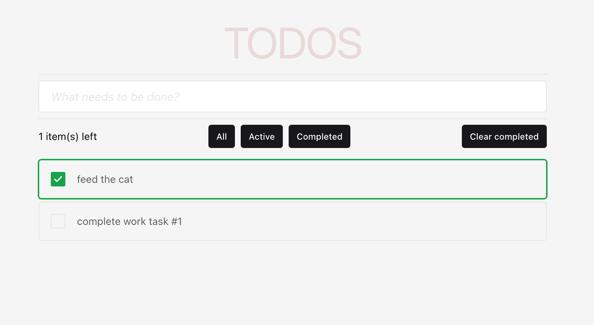

# TODOS

## Description
A simple application for making a list of important things to do. 
Built using React and Chakra UI.

## Preview

## Features
- Simple and intuitive interface
- Filtering by tasks: completed, active, all
- Removing completed tasks from the list
- Main functionality is covered by e2e tests using Cypress